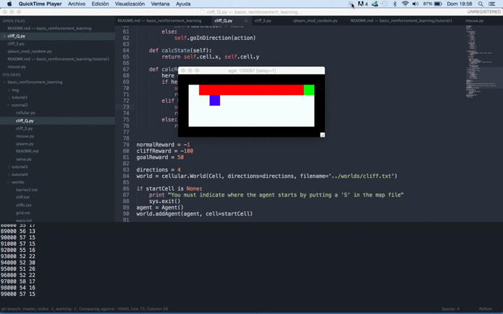
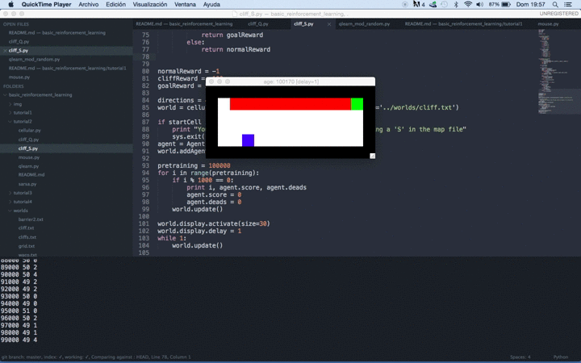

Basic Reinforcement Learning Tutorial 2: SARSA
===================================================

This tutorial builds upon the [Tutorial 1](../tutorial1/README.md) and covers the basics of SARSA using the cliff example. The cliff is a 2D world where a player (blue) has to reach the goal (green) by walking through the world while avoid to fall into the cliff (red).

## Table of Contents
- [Background](#background)
- [Implementation of SARSA](#implementation)
- [Results](#results)
- [Reproduce it yourself](#reproduce)

<div id='background'/>
### Background

The SARSA algorithm is an on-policy (the value functions are updated using results from executing actions determined by some policy)  algorithm for temporal difference learning (TD-learning).

The major difference between it and Q-Learning, is that the maximum reward for the next state is not necessarily used for updating the Q-values. Instead, a new action, and therefore reward, is selected using the same policy that determined the original action. The name Sarsa actually comes from the fact that the updates are done using the quintuple Q(s, a, r, s', a'). Where: s, a are the original state and action, r is the reward observed in the following state and s', a' are the new state-action pair. 

The procedural form of Sarsa algorithm is comparable to that of Q-Learning: 

```
Initialize Q(s, a) arbitrarily
Repeat (for each episode):
	Initialize s
	Choose a from s using policy derived from Q
	While (s is not a terminal state):
		Take action a, observe r, s'
		Choose a' from s' using policy derive from Q
		Q(s,a) += alpha * (r + gamma * max,Q(s', a') - Q(s,a))
		s = s', a = a'
```


<div id='implementation'/>
### Implementation of SARSA

SARSA and Q-learning differ slightly. Here is the Q-learning learn method:

```python
def learn(self, state1, action1, reward, state2):
    maxqnew = max([self.getQ(state2, a) for a in self.actions])
    self.learnQ(state1, action1,
                reward, reward + self.gamma*maxqnew)
```
And here is the SARSA learn method
```python
def learn(self, state1, action1, reward, state2, action2):
    qnext = self.getQ(state2, action2)
    self.learnQ(state1, action1,
                reward, reward + self.gamma * qnext)
```


<div id='results'/>
### Results

Below we present the cliff world after 100 000 generations using a q-learning algorithm:



and now we present the same cliff world, with the same amount of generations using the SARSA algorithm:



The following table, summarizes the results for both algorithms in the 99 000th generation:

| Method | Generation | Score | Cliffs |
|--------|------------|-------|--------|
|Q-learning | 99 000  | 57 | 15 |
|SARSA | 99 000  | 49 | 4 |

After observing both behaviors, one can tell that SARSA follows the *safest path* while Q-learning follows the *quickest path*. Problems that require the least number of errors (a.k.a. falling into the cliff) would likely benefit from SARSA while problems that need to maximise a specific goal would probably benefit from Q-learning.

<div id='reproduce'/>
### Reproduce it yourself

```bash
git clone https://github.com/vmayoral/basic_reinforcement_learning
cd basic_reinforcement_learning
python tutorial2/cliff_S.py # or
python tutorial2/cliff_Q.py
# Replace ../worlds with ./worlds
```
